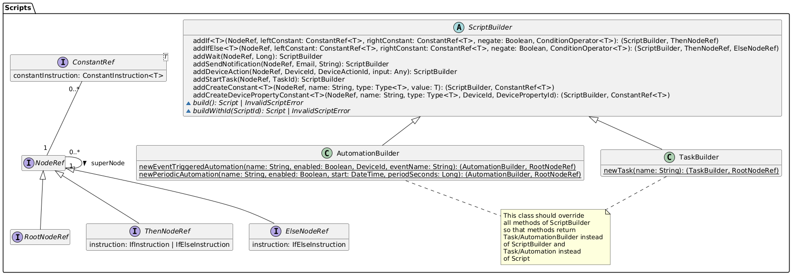

# Design

## Mockups (scenarios)

(This frame cannot be rendered on GitHub so click the link to view it on Figma)

<iframe
style="
  border: 1px solid rgba(0, 0, 0, 0.1);
  height: 700px;"
src="https://embed.figma.com/proto/2LrkXTdBFe5BjsJjpdfBuB/DomoticASW?node-id=1329-206&p=f&scaling=scale-down&content-scaling=fixed&page-id=1214%3A419&starting-point-node-id=1329%3A206&embed-host=share"
allowfullscreen>
</iframe>

Additional details that are not shown in the mockups:

- **Manage tasks**:

  1. After adding an instruction relative to a device, through the "plus" button, it will be added a block with a default action or property of that device. Clicking on the instruction will allow the user change the device action or property

- **Make smart device execute an action**:

  1. When an input control is also used to show the current value of a property, it is not trivial to handle cases in which the value may phisically change slowly.
  1. Right after modifying the content of the input it will be "detached" from the actual property and two buttons (Cancel and Confirm) will be shown.
  1. If "cancel" is pressed then no action is fired and the control returns to be "attached" to the property.
  1. Otherwise if "confirm" is pressed the input control immediately returns to be "attached" to the property and the user will see that value slowly change up to the set one.

- **Sign-up**:

  1. When signing up to the system the first user to do so will immediately become the admin.

- **Manage automations**:

  1. In the "trigger" section the user will choose between triggering by event or periodically.

  - if triggering by event is chosen:

    2. A page with all the devices will be shown and one can be selected.
    3. A block will be added in the trigger section with the device name and a default triggering event.
    4. Clicking that block will allow the user change the triggering event.

  - else if triggering periodically is chosen:

    2. A block will be added in the trigger section with default start time and period
    3. The user can now edit those parameters

## Domain modeling

In every upcoming diagram:

- fields are to be considered readonly, changes to those fields will always be mediated by methods.
- default visibility is _public_ unless otherwise specified.
- about types the "|" character stands for an union type (so "String | Int" means String OR Int)
- about types the "?" character stands for an optional type
- types that extends generic types by concretizing the type parameter are expressed through an arrow with a \<Type> label.

### Users management

This bounded context exposes a _UsersService_ which offers all the methods to implement the use cases.

_UsersService_ service also includes methods for authentication (_login, verifyToken, validateToken_). The idea is that every other service will use this one to validate authentication tokens received by the client.

### UsersService

UsersService is responsible for managing the system’s users. Essentially, its purpose is to centralize all logic related to authentication, authorization, and user lifecycle management.

#### Main Responsibilities

- **User lifecycle**

  - Registration of new users.
  - Approval or rejection of requests by the Admin.

- **User data management**

  - Retrieval of personal data.
  - Modification of nickname and password.
  - Deletion of users from the system.

- **Role-based authorization**

  - Distinction between Admin and User.
  - Enforcement of security rules.

- **Authentication management**
  - Credential validation.
  - Generation and verification of JWT tokens.

##### Security Rules

- The first registered user automatically becomes Admin.
- Regular users can only operate on their own data.
- The Admin has additional privileges: management of users and requests.
- All operations (except login and registration) require a valid token.

### Devices management

This bounded context exposes:

- a _DevicesService_
- a _DeviceGroupsService_
- a _DeviceStatusesService_
- a _DeviceEventsService_

More complex stuff explanation:

- The _DeviceStatusesService_ service will be responsible for keeping the devices _DeviceStatus_ up to date, and allows for subscribers to listen to status change events.
- The _DeviceEventsService_ service will be responsible for receiving *DeviceEvent*s (through the _publishEvent_ method) from the devices, and allows for subscribers to be notified about *DeviceEvent*s.
- The _DeviceGroupsService_ and *DeviceGroup*s are responsible for managing the N-N relationships with *Device*s.
- The _DevicesService_ is responsible for keeping *DeviceGroup*s up to date in case of device removal.
- The _DevicesService_ offers the method _updateDeviceProperty_ which can be invoked by devices to notify the server about their current state. (It is also possible to subscribe for changes)

#### TypeConstraints

Since devices will define their own action and properties they must also define what datatypes they are.

Types are defined in the _Type_ enum which is generic on T which reprents the actual datatype that will be used internally.

A _TypeConstraint_ is a constraint over a type which can also have additional constraints over the values, for example:
An input which requires an integer from 0 to 100 can be modeled as a subclass of _TypeConstraint_ with _Type_ "IntType" which overrides the _validate_ method implementing that logic (in the diagram we called this _IntRange_).

*DeviceProperty*s which have a setter will use its _TypeConstraint_, otherwise they will have their own _TypeConstraint_.

A setter is a _DeviceAction_ whose execution is expected to set a property with the given input. This allows to create richer user interfaces where properies and actions are bound.

*DeviceAction*s have just one _TypeConstraint_ which constraints the input they can take. Actions that require no input can be implemented by an input of _Type_ "VoidType".

### Notifications

This bounded context exposes a _NotificationsService_ which offers all the methods to implement the use cases.

The service subscribes itself to the _DeviceStatusesService_ to be informed when a device goes offline.

To achieve eventual consistency in case of the removal of a user from the system, the next time a device offline notification would be sent to that user the service will remove that subscription from the repository.

Regarding device removal from the system, it is not a bad idea to keep the subscription.
Let's say that the _DeviceId_ is actually a hardware identifier, in case that device will be added again to the system, subscription would be valid again.

### Permissions

This bounded context exposes a _PermissionsService_ which offers all the methods to implement the use cases.

A more detailed explanation of *PermissionsService*:
- *registerScriptService*: this method is implemented because of the double dependece between *PermissionsService* and the *ScriptService*. It is used only at the start of the program.
- *canExecuteTask*: it is responsible for implementing the expected behaviour (checking user-device permissions and in the case of a presence in the blacklist or the whitelist uses that as decision factor). The method always permits to an admin to execute a task, bypassing every control.
- *canExecuteActionOnDevice*: it checks if the calling user has the permission to execute actions on the specified device. It is implemented by checking the *userDevicePermissionRepository*. The method permits to an admin to execute an action even if there is no record on the *userDevicePermissionRepository*.
- *canEdit*: it checks if the user can edit a specified script. It simply checks if the user is an admin or the editList of the script contains the user email. 
- *addToWhiteList* and *addToBlackList*: they are responsible of adding and removing permissions of an user. Only an admin can use these methods and if the tasklists of the relative taskId doesn't exist, it will be created. Even if the blacklist or the whitelist doesn't exist they will be created in order to add the user email. An important note is that an admin cannot be added to the blacklist, it is possible to add an admin in the whitelist, but it doesn't produce any positive effect, because an admin can already perform every action.
- The others methods allow to add, remove or search entities. They are coherent with their names and only an admin can perform them.
- Methods that could generate some confusion about their names are *getAllUserDevicePermissions* and *getAllUserDevicePermissionsOfAnUser*. The first one will get every permission for every user device; the second one will get every permissions that an user has on devices.

### Scripts

This bounded context exposes a _ScriptsService_ which offers all the methods to implement the use cases.

A Script can be either a Task or an Automation the main difference is that automations have a Trigger.

Each script has a sequence of Instructions that has the following behaviour when executed based on the concrete implementation:

- SendNotificationInstruction: sends a notification to a user
- WaitInstruction: pauses the script execution for a given amount of seconds
- StartTaskInstruction: starts another task waiting for its completion
- DeviceActionInstruction: make a device execute the specified action with the given input
- ConstantInstruction:
  - CreateConstantInstruction: defines a constant with a given value
  - CreateDevicePropertyConstantInstruction: defines a constant which will get it's value at runtime from a device property
- IfInstruction: defines a sequence of instructions that are executed only if the condition evaluates to true at runtime. (The condition is based on constants)
- IfElseInstruction: defines two sequences of instructions that are executed if the condition evaluate to true or false respectively.

Conditions must operate on homogeneous types and for each type a fixed set of operators are given.

When a script is executed it creates internally an ExecutionEnvironment which is responsible for storing constant values.
Tasks need a token to be executed manually by a user, while Automations do not (because they are executed automatically given a period of time or a device event firing). Tasks can also be executed without a token if executed through a Start Task Instruction inside a script.

#### Builders

Builders can check whether a script syntax is correct, but they cannot do the same with regard to semantics (because they would need to access devices data in the repository).

Scripts semantic correctness is checked by the ScriptsService

# Other doc

- [Description](./README.md)
- [Analysis](./01-Analysis.md)
- [Architecture (next)](./03-Architecture.md)
- [DevOps](./04-DevOps.md)
- [Implementation](./05-Implementation.md)

## Distribuited doc

- [Distribuited](./06-Distribuited.md)