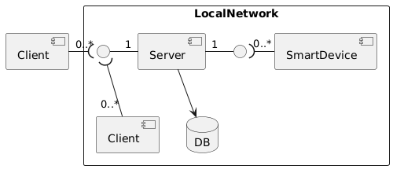

# Architecture

### System architecture

### Server architecture

The server implementation will follow an hexagonal architecture design.

The separation between domain, ports and adapters is clearly enforced by the folder structure:

- [src/domain](https://github.com/DomoticASW/server/tree/main/src/domain)
- [src/ports](https://github.com/DomoticASW/server/tree/main/src/ports)
- [src/adapters](https://github.com/DomoticASW/server/tree/main/src/adapters)

# Other doc

- [Description](./README.md)
- [Analysis](./01-Analysis.md)
- [Design](./02-Design.md)
- [DevOps (next)](./04-DevOps.md)
- [Implementation](./05-Implementation.md)
