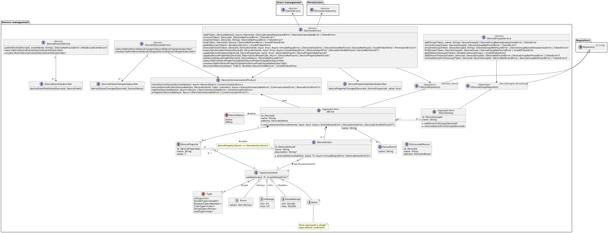

# Design

## Mockups (scenarios)

(This frame cannot be rendered on GitHub so click the link to view it on Figma)
<iframe
style="
  border: 1px solid rgba(0, 0, 0, 0.1);
  height: 700px;"
src="https://embed.figma.com/proto/2LrkXTdBFe5BjsJjpdfBuB/DomoticASW?node-id=1329-206&p=f&scaling=scale-down&content-scaling=fixed&page-id=1214%3A419&starting-point-node-id=1329%3A206&embed-host=share"
allowfullscreen>
</iframe>

Additional details that are not shown in the mockups:

- **Manage tasks**:
  1. After adding an instruction relative to a device, through the "plus" button, it will be added a block with a default action or property of that device. Clicking on the instruction will allow the user change the device action or property

- **Make smart device execute an action**:
  1. When an input control is also used to show the current value of a property, it is not trivial to handle cases in which the value may phisically change slowly.
  1. Right after modifying the content of the input it will be "detached" from the actual property and two buttons (Cancel and Confirm) will be shown.
  1. If "cancel" is pressed then no action is fired and the control returns to be "attached" to the property.
  1. Otherwise if "confirm" is pressed the input control immediately returns to be "attached" to the property and the user will see that value slowly change up to the set one.

- **Sign-up**:
  1. When signing up to the system the first user to do so will immediately become the admin.

- **Manage automations**:
  1. In the "trigger" section the user will choose between triggering by event or periodically.

    - if triggering by event is chosen:

      2. A page with all the devices will be shown and one can be selected.
      2. A block will be added in the trigger section with the device name and a default triggering event.
      2. Clicking that block will allow the user change the triggering event.

    - else if triggering periodically is chosen:

      2. A block will be added in the trigger section with default start time and period
      2. The user can now edit those parameters

## Domain modeling
In every upcoming diagram:
- fields are to be considered readonly, changes to those fields will always be mediated by methods.
- default visibility is *public* unless otherwise specified.
- about types the "|" character stands for an union type (so "String | Int" means String OR Int)
- about types the "?" character stands for an optional type
- types that extends generic types by concretizing the type parameter are expressed through an arrow with a \<Type> label.

### Users management

This bounded context exposes a *UsersService* which offers all the methods to implement the use cases.

*UsersService* service also includes methods for authentication (*login, verifyToken, validateToken*). The idea is that every other service will use this one to validate authentication tokens received by the client.

### Devices management

This bounded context exposes:
- a *DevicesService*
- a *DeviceGroupsService*
- a *DeviceStatusesService*
- a *DeviceEventsService*

More complex stuff explanation:
- The *DeviceFactory* is able to create a *Device* just through an URL as it will contact the device on that address which will then describe himself.
- The *DeviceStatusesService* service will be responsible for keeping the devices *DeviceStatus* up to date, and allows for subscribers to listen to status change events.
- The *DeviceEventsService* service will be responsible for receiving *DeviceEvent*s (through the *publishEvent* method) from the devices, and allows for subscribers to be notified about *DeviceEvent*s.
- The *DeviceGroupsService* and *DeviceGroup*s are responsible for managing the N-N relationships with *Device*s.
- The *DevicesService* is responsible for keeping *DeviceGroup*s up to date in case of device removal.
- The *DevicesService* offers the method *updateDeviceProperty* which can be invoked by devices to notify the server about their current state. (It is also possible to subscribe for changes)

#### TypeConstraints
Since devices will define their own action and properties they must also define what datatypes they are.

Types are defined in the *Type* enum which is generic on T which reprents the actual datatype that will be used internally.

A *TypeConstraint* is a constraint over a type which can also have additional constraints over the values, for example:
An input which requires an integer from 0 to 100 can be modeled as a subclass of *TypeConstraint* with *Type* "IntType" which overrides the *validate* method implementing that logic (in the diagram we called this *IntRange*).

*DeviceProperty*s which have a setter will use its *TypeConstraint*, otherwise they will have their own *TypeConstraint*.

A setter is a *DeviceAction* whose execution is expected to set a property with the given input. This allows to create richer user interfaces where properies and actions are bound.

*DeviceAction*s have just one *TypeConstraint* which constraints the input they can take. Actions that require no input can be implemented by an input of *Type* "VoidType".

### Notifications

This bounded context exposes a *NotificationsService* which offers all the methods to implement the use cases.

The service subscribes itself to the *DeviceStatusesService* to be informed when a device goes offline.

To achieve eventual consistency in case of the removal of a user from the system, the next time a device offline notification would be sent to that user the service will remove that subscription from the repository.

Regarding device removal from the system, it is not a bad idea to keep the subscription.
Let's say that the *DeviceId* is actually a hardware identifier, in case that device will be added again to the system, subscription would be valid again.

### Permissions

This bounded context exposes a *PermissionsService* which offers all the methods to implement the use cases.

The *canExecuteTask* method is responsible for implementing the expected behaviour (checking user-device permissions and in case of presence in blacklist or whitelist use that as decision factor).

### Scripts

This bounded context exposes a *ScriptsService* which offers all the methods to implement the use cases.

A Script can be either a Task or an Automation the main difference is that automations have a Trigger.

Each script has a sequence of Instructions that has the following behaviour when executed based on the concrete implementation:
- SendNotificationInstruction: sends a notification to a user
- WaitInstruction: pauses the script execution for a given amount of seconds
- StartTaskInstruction: starts another task waiting for its completion
- DeviceActionInstruction: make a device execute the specified action with the given input
- ConstantInstruction:
  - CreateConstantInstruction: defines a constant with a given value
  - CreateDevicePropertyConstantInstruction: defines a constant which will get it's value at runtime from a device property
- IfInstruction: defines a sequence of instructions that are executed only if the condition evaluates to true at runtime. (The condition is based on constants)
- IfElseInstruction: defines two sequences of instructions that are executed if the condition evaluate to true or false respectively.

Conditions must operate on homogeneous types and for each type a fixed set of operators are given.

When a script is executed it creates internally an ExecutionEnvironment which is responsible for storing constant values.

#### Builders

Builders can check whether a script syntax is correct, but they cannot do the same with regard to semantics (because they would need to access devices data in the repository).

Scripts semantic correctness is checked by the ScriptsService

