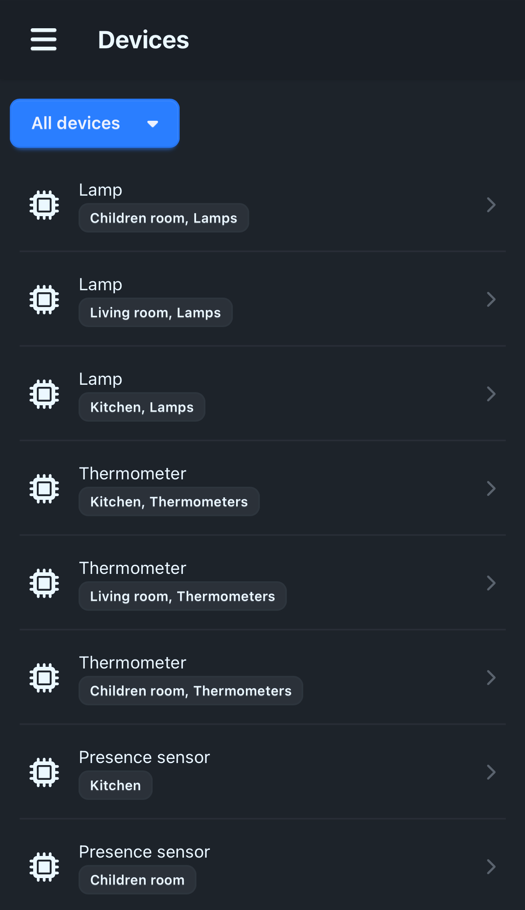
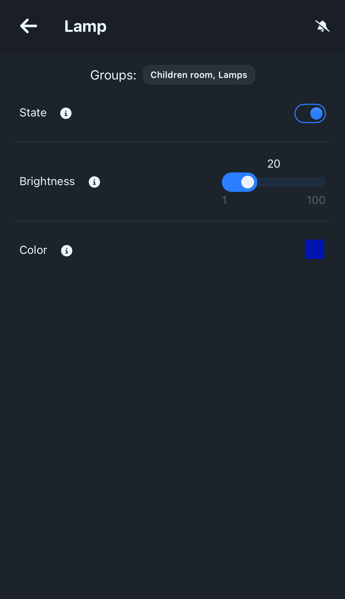
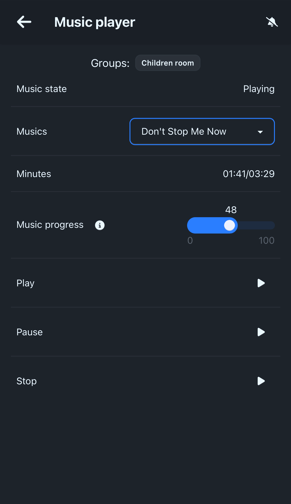
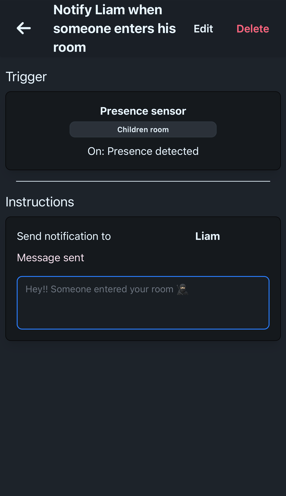
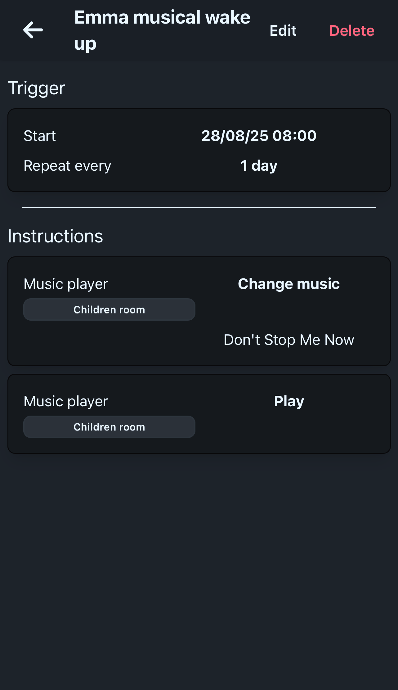
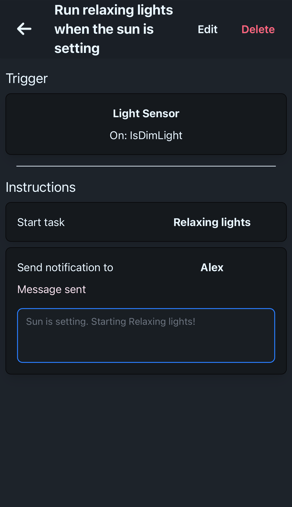
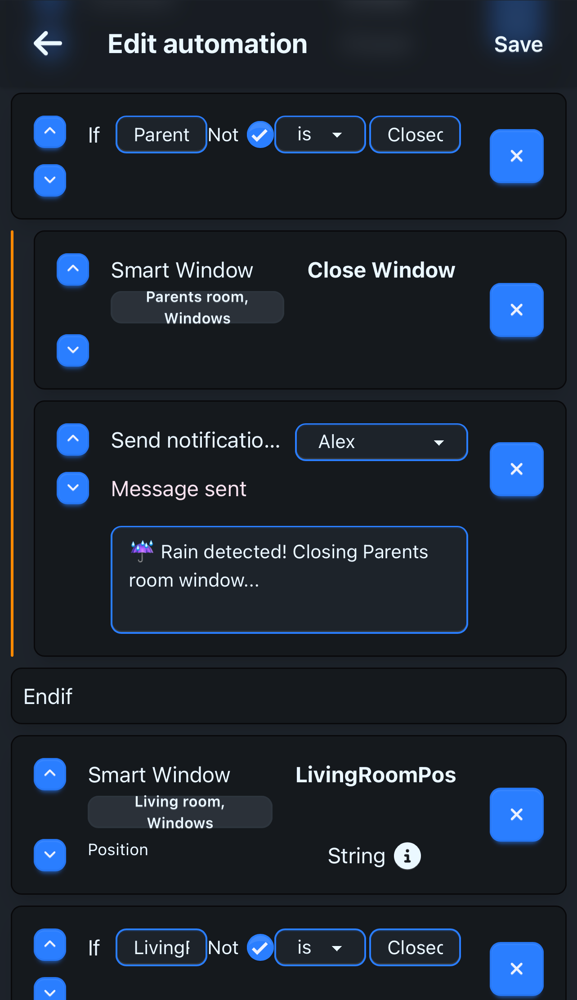
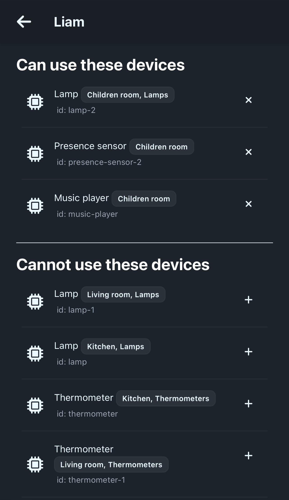
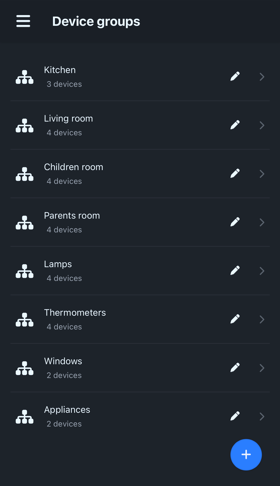

# DomoticASW

### Distributed Systems course

## Developers

- [Alessandro Venturini](mailto:alessandro.venturin6@studio.unibo.it)
- [Francesco Carlucci](mailto:francesco.carlucci6@studio.unibo.it)
- [Corrado Stortini](mailto:corrado.stortini2@studio.unibo.it)
- [Marco Raggini](mailto:marco.raggini2@studio.unibo.it)

## Screenshots of the application 

    
    
    
    
    
    
    
    
    

## Project description

Create a smart home system and its own protocol, allowing devices to be added or removed dynamically (without having to stop the system).

The protocol enables smart home devices to describe the actions they support and the data they generate.
This means device manufacturers can create compatible devices without requiring changes to the system.

Users interact with the system through web client.
The web client doesn’t talk directly to the smart devices but communicates through a server installed in the house.

The server is also accessible online, so users can manage their home remotely.

Automations can be set up, triggered either by users or external events.

The client can receive custom push notifications from the server, such as:

- Alerts when a device goes offline
- Notifications when the temperature hits a set threshold
- Updates when the washing machine finishes its cycle
- Results of a scheduled automation

There are two types of users:

- **Admin**: Can add and remove devices from the system and define which devices other users can interact with. (The admin also uses the system, he's not technical staff.)
- **User**: Can only interact with devices they’ve been given access to by the admin.

The system includes an authentication feature so that only authenticated users can interact with it.
Users can register themselves but won’t be able to use the system until approved by an admin.

### System Components

- Server
- Web Client
- Multiple IoT devices

### Technologies

We plan to use:

- MEVN stack (using TypeScript where possible)
- Other languages or runtimes to implement the devices
- HTTP REST APIs for client-server and server-device communication
- Docker to containerize components (server and devices)
- Docker Compose for easier development and testing
- Kubernetes for deployment

### Fault Tolerance and Resilience

- Since there are several devices in the house, it’s important for the server to track which devices are active and working properly, detecting offline devices if possible.
- Ensure the server can automatically restart in case of a crash.

## Try DomoticASW

We have prepared a [full demo](https://github.com/DomoticASW/demo) with sample data in order to let you try DomoticASW.

## Other important repositories

- [Server](https://github.com/DomoticASW/server)
- [Client](https://github.com/DomoticASW/client)

# Other doc

- [Analysis](./01-Analysis.md)
- [Design](./02-Design.md)
- [Architecture](./03-Architecture.md)
- [DevOps](./04-DevOps.md)
- [Implementation](./05-Implementation.md)

## Distribuited doc

- [Distribuited](./06-Distribuited.md)
