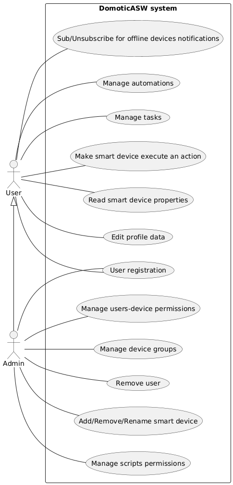
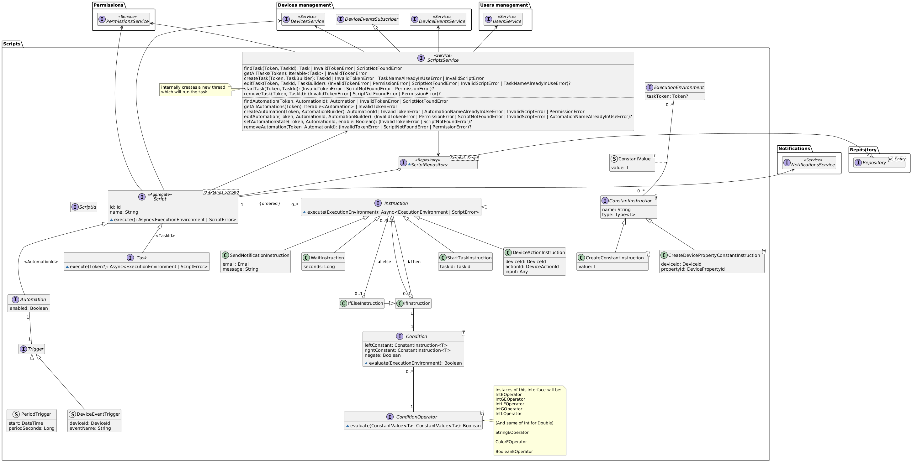

# DomoticASW

## Developers
- [Alessandro Venturini](mailto:alessandro.venturin6@studio.unibo.it)
- [Francesco Carlucci](mailto:francesco.carlucci6@studio.unibo.it)
- [Corrado Stortini](mailto:corrado.stortini2@studio.unibo.it)
- [Marco Raggini](mailto:marco.raggini2@studio.unibo.it)

## Project description
Create a smart home system and its own protocol, allowing devices to be added or removed dynamically (without having to stop the system).

The protocol enables smart home devices to describe the actions they support and the data they generate.
This means device manufacturers can create compatible devices without requiring changes to the system.

Users interact with the system through web client.
The web client doesn’t talk directly to the smart devices but communicates through a server installed in the house.

The server is also accessible online, so users can manage their home remotely.

Automations can be set up, triggered either by users or external events.

The client can receive custom push notifications from the server, such as:
- Alerts when a device goes offline
- Notifications when the temperature hits a set threshold
- Updates when the washing machine finishes its cycle
- Results of a scheduled automation

There are two types of users:
- **Admin**: Can add and remove devices from the system and define which devices other users can interact with. (The admin also uses the system, he's not technical staff.)
- **User**: Can only interact with devices they’ve been given access to by the admin.

The system includes an authentication feature so that only authenticated users can interact with it.
Users can register themselves but won’t be able to use the system until approved by an admin.

### System Components
- Server
- Web Client
- Multiple IoT devices

### Technologies
We plan to use:
- MEVN stack (using TypeScript where possible)
- Other languages or runtimes to implement the devices
- HTTP REST APIs for client-server and server-device communication
- Docker to containerize components (server and devices)
- Docker Compose for easier development and testing
- Kubernetes for deployment

### Fault Tolerance and Resilience
- Since there are several devices in the house, it’s important for the server to track which devices are active and working properly, detecting offline devices if possible.
- Ensure the server can automatically restart in case of a crash.

## Target users

- **Age range**: 8 -> 75
- **Level of confidence with technology**:
  - Know how to use a smartphone
  - Know how to browse the internet
- **Goals and reasons**:
  - Easier and constant home monitoring
  - Remote interaction with their home or devices
  - Automation to speed up or ease recurring activities
  - Reduce their home environmental footprint
- **Interests**:
  - Keeping their home up to date with the latest technologies
  - Electronics
  - IT
  - Being environment friendly

## Personas

### Alex Carter  

- **Type of target user**: Geek homeowner
- **Age**: 43
- **Occupation**: Software Engineer  
- **Tech Confidence**: High  
- **Goals**:  
  - Experiment with custom automations for smart devices.  
  - Seamlessly integrate new devices from various manufacturers.
- **Interests**:  
  - Programming, optimizing home workflows, staying on the cutting edge of technology.
- **Relationships**:
  - [Mia Fernandez](#mia-fernandez)'s husband
  - [Liam Carter](#liam-carter)'s parent
  - [Emma Carter](#emma-carter)'s parent

### Mia Fernandez

- **Type of target user**: Eco-Conscious Parent
- **Age**: 40  
- **Occupation**: Environmental Consultant  
- **Tech Confidence**: Moderate  
- **Goals**:  
  - Monitor and reduce energy consumption at home.  
  - Get notifications on energy usage trends or anomalies.
- **Interests**:  
  - Environment-friendly practices, sustainable living, family well-being.  
- **Relationships**:
  - [Alex Carter](#alex-carter)'s wife
  - [Liam Carter](#liam-carter)'s parent
  - [Emma Carter](#emma-carter)'s parent

### Emma Carter

- **Type of target user**: Young Teen
- **Age**: 10  
- **Occupation**: Elementary School Student  
- **Tech Confidence**: High given her age  
- **Goals**:  
  - Playfully disrupt Liam’s automations (e.g., turning lights off and on).  
- **Interests**:  
  - Playing games, trying out tech, and sibling rivalry.  
  - Playing music in her room.
- **Relationships**:
  - [Liam Carter](#liam-carter)'s sister

### Liam Carter

- **Type of target user**: Young Teen
- **Age**: 12
- **Occupation**: Student  
- **Tech Confidence**: Moderate  
- **Goals**:  
  - Customize lights or music for their room.
  - Prank his sister by locking her in her room when she makes fool of him.
- **Interests**:  
  - Gaming setups, customizing room ambiance, experimenting with tech.  
- **Relationships**:
  - [Emma Carter](#emma-carter)'s brother

### Evelyn Moore  

- **Type of target user**: Elderly User
- **Age**: 72  
- **Occupation**: Retired Teacher  
- **Tech Confidence**: Low  
- **Goals**:  
  - Turn on and off lights without having to get to the switch.
  - Receive clear and concise alerts for critical security events.
- **Interests**:  
  - Home security, maintaining independence.  

### Jordan Patel  

- **Type of target user**: Mobility-limited User
- **Age**: 32  
- **Occupation**: Freelance Illustrator  
- **Tech Confidence**: Moderate  
- **Goals**:  
  - Use voice commands or simplified controls due to mobility limitations.  
  - Automate routines to enhance accessibility (e.g., blinds opening automatically).  
- **Interests**:  
  - Accessibility tech, convenience, creative pursuits, basketball.  

### Claire Bennett  

- **Type of target user**: Busy Professional
- **Age**: 45  
- **Occupation**: Corporate Executive  
- **Tech Confidence**: Moderate  
- **Goals**:  
  - Take care of the house remotely due to frequent business trips.
  - Automate recurring tasks like setting the thermostat or starting appliances.  
- **Interests**:  
  - Work-life balance, smart time management, luxury tech.

## Requirements

### User stories
|As a|I want|so that|
|-----|----------|-------------|
|Admin|to add, remove or rename smart devices in my smart home|i can extend my domotic system|
|Admin|to be able to set up user-device permissions and as a consequence tasks can be executed only by users that own the user-device permission for every device included in the task|i can prohibit uninteded use of the system|
|Admin|tasks to have a user whitelist and a user blacklist to override user-device permissions|i can prohibit uninteded use of the system|
|Admin|tasks and automations to have an editlist to specify which user can edit that|i can prohibit uninteded use of the system|
|Admin|to review and accept or decline users registration requests|i can manage who has access to the system|
|Admin|to be able to remove users from the system|i can manage who has access to the system|
|Admin|to organize the home devices in groups|it's easier to manage them|
|User |to see the properties exposed by my smart devices|i can gain knowledge about the state of the house|
|User |to make smart devices execute an action|i can alter the state of the house|
|User |to set up tasks to be executed with one click|i can automate the execution of multiple instructions|
|User |to express conditional logic in my tasks|i can achieve complex behaviour|
|User |to set up automations to be executed periodically or when specific triggering events happen|my home can do stuff even without me taking care of it|
|User |to enable and disable automations|i can stop some automations to run for a while|
|User |to receive a notification when a specific device goes offline|i can fix problems in case they happen|
|User |to edit my profile data like my nickname, email and password|i can keep my data up to date|

### Non functional requirements
- The domotic system must be compatible with devices produced by multiple other manifacturers
- The domotic system should be accessible through the internet so that it can be accessed remotely
- The domotic system should be accessible through the local network so that internet access is not required when the user is phisically in their house
- The domotic system should be accessible both from desktop and mobile clients
- Users (and the admin) must be authenticated in order to interact with the system
- The server should restart automatically in case of a crash

## Ubiquitous language
|Word|Definition|Synonyms|
|----|----------|--------|
|User|A person which interacts with the domotic system||
|Nickname|A simple name or string that the user choose to present himself to other users|Username|
|Email|An e-mail address that it used to identify a user inside the system|E-mail|
|Password|A string that grants the access to a user account||
|Admin|A role played by a user of the system which is responsible for its management|Administrator|
|Smart home|A phisical house equipped with a software to manage connected smart devices|Domotic, Domotic system, Home, System|
|Smart device|An electronic device able to interact or sense the environment, generally connected to other devices or networks|IoT device, device|
|Client|A computer (mobile or desktop) used by the users to interact with the system||
|Remote access|Ability to access the domotic system even if not connected to the local network||
|Property|Some data provided by a smart device|Device data|
|Action|An operation that can be executed by a smart device||
|Notification|A message sent by the server to every user that wants to receive it||
|Instruction|An operation that can be executed by the domotic system (for example running a device action, reading some property on a device or sending a notification, wait for some time, set constants for scripting purposes and start other tasks). Instructions can have inputs||
|Constant|A name with an associated value of a specific type. It can be set manually or by reading a device property|variable|
|Type (scripting)|A set of possible values||
|Control flow instructions|Instructions that can alter the control flow of the script (if and if-else) based on a condition||
|Condition|An expression that results in a boolean value||
|Task|A sequence of instructions to be executed||
|Automation|A sequence of instructions triggered by an automation trigger||
|Script|A task or an automation||
|Active/Inactive automation|An automation that is/is not run by the domotic system when it triggers||
|Automation trigger|A device event or a time period specification|trigger|
|Triggering period|How frequently an automation should be run, has a starting point in time|period|
|Device event|An event that can be fired by a device||
|Offline device|A smart device that is not reachable by the domotic system||
|Interacting with a device|A client that reads properties or runs actions on a smart device||
|User-Device permission|Right of a user to interact with some device|User permission|
|Task permissions|A task whitelist, blacklist and editlist||
|Automation permissions|An automation editlist||
|Task whitelist|A list of users that can run the task regardless of their user-device permissions||
|Task blacklist|A list of users that cannot run the task regardless of their user-device permissions||
|Task/Automation editlist|A list of users which can edit the script||
|Registration request|A user must send a registration request that must be accepted by the admin before he can interact with the system||
|Device group|A grouping of smart devices, each device can be part of 0 or N groups|Group|
|Server|A computer installed in the house responsible for managing all aspects of the domotic system||
|Token|A piece of data that contains information about a user and it's role in the system. It is signed in order to prove it's validity||

## Use case

## Mockups (scenarios)

(This frame cannot be rendered on GitHub so click the link to view it on Figma)
<iframe
style="
  border: 1px solid rgba(0, 0, 0, 0.1);
  height: 700px;"
src="https://embed.figma.com/proto/2LrkXTdBFe5BjsJjpdfBuB/DomoticASW?node-id=1329-206&p=f&scaling=scale-down&content-scaling=fixed&page-id=1214%3A419&starting-point-node-id=1329%3A206&embed-host=share"
allowfullscreen>
</iframe>

Additional details that are not shown in the mockups:

- **Manage tasks**:
  1. After adding an instruction relative to a device, through the "plus" button, it will be added a block with a default action or property of that device. Clicking on the instruction will allow the user change the device action or property

- **Make smart device execute an action**:
  1. When an input control is also used to show the current value of a property, it is not trivial to handle cases in which the value may phisically change slowly.
  1. Right after modifying the content of the input it will be "detached" from the actual property and two buttons (Cancel and Confirm) will be shown.
  1. If "cancel" is pressed then no action is fired and the control returns to be "attached" to the property.
  1. Otherwise if "confirm" is pressed the input control immediately returns to be "attached" to the property and the user will see that value slowly change up to the set one.

- **Sign-up**:
  1. When signing up to the system the first user to do so will immediately become the admin.

- **Manage automations**:
  1. In the "trigger" section the user will choose between triggering by event or periodically.

    - if triggering by event is chosen:

      2. A page with all the devices will be shown and one can be selected.
      2. A block will be added in the trigger section with the device name and a default triggering event.
      2. Clicking that block will allow the user change the triggering event.

    - else if triggering periodically is chosen:

      2. A block will be added in the trigger section with default start time and period
      2. The user can now edit those parameters

## Bounded contexts

- Users management context

  This context handles everything related to user accounts.
  - User login, registration, approval, and removal.
  - Session token verification
  - Editing user profiles (nickname, email, password).

- Devices management context

  This context is responsible for managing the lifecycle of smart devices and the interfaces they offer.
  - Adding, removing, and renaming smart devices.
  - Organizing devices into groups.
  - Tracking device status (online/offline).
  - Exposing device properties and events.
  - Managing device actions (executing them and setting input controls).

- Scripts context

  This context focuses on automating the functionality of the smart home.
  - Defining and executing tasks
  - Defining automations triggered by events or periodically.
  - Managing automation states (active/inactive).
  - Providing graphical scripting capabilities (constants, control flow instructions, and conditions).

- Permissions context

  This context handles everything related to permissions and access control.
  - Handling user-device permissions.
  - task whitelist/blacklist.
  - scripts editlist.

- Notifications context

  This context handles notifications sent to the users.
  - Sending notifications when devices go offline
  - Sending custom notification from tasks
  - Configuring notification preferences for users.

- System access context

  This context deals with remote/local system access.
  - Supporting local network access when users are home.
  - Enabling remote access for managing the system from anywhere.

## Domain modeling
In every upcoming diagram:
- fields are to be considered readonly, changes to those fields will always be mediated by methods.
- default visibility is *public* unless otherwise specified.
- about types the "|" character stands for an union type (so "String | Int" means String OR Int)
- about types the "?" character stands for an optional type
- types that extends generic types by concretizing the type parameter are expressed through an arrow with a \<Type> label.

### Users management

This bounded context exposes a *UsersService* which offers all the methods to implement the use cases.

*UsersService* service also includes methods for authentication (*login, verifyToken, validateToken*). The idea is that every other service will use this one to validate authentication tokens received by the client.

### Devices management

This bounded context exposes:
- a *DevicesService*
- a *DeviceGroupsService*
- a *DeviceStatusesService*
- a *DeviceEventsService*

More complex stuff explanation:
- The *DeviceStatusesService* service will be responsible for keeping the devices *DeviceStatus* up to date, and allows for subscribers to listen to status change events.
- The *DeviceEventsService* service will be responsible for receiving *DeviceEvent*s (through the *publishEvent* method) from the devices, and allows for subscribers to be notified about *DeviceEvent*s.
- The *DeviceGroupsService* and *DeviceGroup*s are responsible for managing the N-N relationships with *Device*s.
- The *DevicesService* is responsible for keeping *DeviceGroup*s up to date in case of device removal.
- The *DevicesService* offers the method *updateDeviceProperty* which can be invoked by devices to notify the server about their current state. (It is also possible to subscribe for changes)

#### TypeConstraints
Since devices will define their own action and properties they must also define what datatypes they are.

Types are defined in the *Type* enum which is generic on T which reprents the actual datatype that will be used internally.

A *TypeConstraint* is a constraint over a type which can also have additional constraints over the values, for example:
An input which requires an integer from 0 to 100 can be modeled as a subclass of *TypeConstraint* with *Type* "IntType" which overrides the *validate* method implementing that logic (in the diagram we called this *IntRange*).

*DeviceProperty*s which have a setter will use its *TypeConstraint*, otherwise they will have their own *TypeConstraint*.

A setter is a *DeviceAction* whose execution is expected to set a property with the given input. This allows to create richer user interfaces where properies and actions are bound.

*DeviceAction*s have just one *TypeConstraint* which constraints the input they can take. Actions that require no input can be implemented by an input of *Type* "VoidType".

### Notifications

This bounded context exposes a *NotificationsService* which offers all the methods to implement the use cases.

The service subscribes itself to the *DeviceStatusesService* to be informed when a device goes offline.

To achieve eventual consistency in case of the removal of a user from the system, the next time a device offline notification would be sent to that user the service will remove that subscription from the repository.

Regarding device removal from the system, it is not a bad idea to keep the subscription.
Let's say that the *DeviceId* is actually a hardware identifier, in case that device will be added again to the system, subscription would be valid again.

### Permissions

This bounded context exposes a *PermissionsService* which offers all the methods to implement the use cases.

The *canExecuteTask* method is responsible for implementing the expected behaviour (checking user-device permissions and in case of presence in blacklist or whitelist use that as decision factor).

### Scripts

This bounded context exposes a *ScriptsService* which offers all the methods to implement the use cases.

A Script can be either a Task or an Automation the main difference is that automations have a Trigger.

Each script has a sequence of Instructions that has the following behaviour when executed based on the concrete implementation:
- SendNotificationInstruction: sends a notification to a user
- WaitInstruction: pauses the script execution for a given amount of seconds
- StartTaskInstruction: starts another task waiting for its completion
- DeviceActionInstruction: make a device execute the specified action with the given input
- ConstantInstruction:
  - CreateConstantInstruction: defines a constant with a given value
  - CreateDevicePropertyConstantInstruction: defines a constant which will get it's value at runtime from a device property
- IfInstruction: defines a sequence of instructions that are executed only if the condition evaluates to true at runtime. (The condition is based on constants)
- IfElseInstruction: defines two sequences of instructions that are executed if the condition evaluate to true or false respectively.

Conditions must operate on homogeneous types and for each type a fixed set of operators are given.

When a script is executed it creates internally an ExecutionEnvironment which is responsible for storing constant values.

#### Builders

Builders can check whether a script syntax is correct, but they cannot do the same with regard to semantics (because they would need to access devices data in the repository).

Scripts semantic correctness is checked by the ScriptsService

## Architecture

### System architecture

### Server architecture
The server implementation will follow an hexagonal architecture design.

## Software process
Every rule described below must be applied both to the server and the client repositories unless otherwise specified by them.

### Branching model and GitHub branch protection rules
It has been decided to adopt [GitFlow](https://www.atlassian.com/git/tutorials/comparing-workflows/gitflow-workflow) as branching model.
Releases will be published from the main branch.

In order to build high quality software brach protection rules have been applied to the `main` and `develop` branches resulting in the following constraints:
- merging/pushing is only allowed by means of a pull request
- pull requests must pass every check (tests, lint, ecc...) before they can be merged.
- pull requests must be reviewed and approved by another team member before they can be merged.
- force pushes are disabled

Many CI workflows run only on pull requests since these cannot be skipped in the process.

### Semantic release
The semantic-release workflow automates the versioning and publishing process for the GitHub repository and NPM package.
It analyzes commit messages and it determines the appropriate version number and publishes the new release automatically, eliminating the need for manual version management.
This workflow runs automatically on pushes to the main branch.

Moreover the release of an NPM package allows to distribute the package more easily because, for example, with just the command `npm install @domoticasw/server` it is possible to install the latest version of the server package without having to specify the version number or anything else.

#### NPM token
The NPM token is an authentication key used to publish packages the NPM registry. It allows semantic-release to authenticate with NPM and push the new package version, it is stored as a GitHub Actions secret to prevent unauthorized access.

### Conventional commits

Since semantic release is being adopted it has been decided to use [commitlint](https://github.com/conventional-changelog/commitlint) in order to enforce conventional commit messages (both in the client and server repositories).

#### commitlint CI
[DomoticASW commitlint github action](https://github.com/DomoticASW/commitlint) is run in a github workflow on every pull request in order to prohibit invalid commit messages.

It works by running commitlint verifying all the commits from the pull request base up to its head.

#### commitlint git hook
Executing commitlint only on the remote means that the developer will discover that the commit messages he wrote were wrong only after pushing them, and to fix the problem he would be forced to reword the commits and push again.

To avoid this problem a pre-commit git hook have been written under the `hooks` directory both in the server and in the client. It must be installed through the `setup.sh` script which can be found in the root of both the repositories.

> **Note:**
>
> Running commitlint on the remote is kept as a safety measure since there's no way to trust the developer that he will install the git hook.

### Semantic-release and commitlint github actions

It has been decided to extract the [semantic-release workflow](https://github.com/DomoticASW/semantic-release) and the [commitlint workflow](https://github.com/DomoticASW/commitlint) into two different github actions of the organization so that they can be resued both from the server and the client.

### Client CI test suite

For the client CI has been decided to just test that the code passes the lint and compiles.
Automated tests are not possible due to being just the GUI of the wep app.

### Serve client web app from within the server using git submodules

We used git submodules to link the client repository within the server repository.
This approach allows us to maintain a clear separation between the two repositories while still being able to serve the client from within the server.

A limitation of this method is that the submodule points to a specific commit of the client repository. As a result, updates to the client repository are not automatically reflected in the server repository and must be manually updated.

## Implementation

### Devices management

#### Protocol

It is required that every device while requesting an ip from the LAN DHCP server will also specify a name to bind to that ip.
This allows the server to store this name and use it to reach devices even if they change their ip.

##### Devices discovery

Devices announce themselves on a configurable known port by sending broadcast UDP datagrams including basic data (id, name, lan hostname and port) that can be used by the server to register them to the system.
The server [DeviceDiscovererUDPAdapter.ts](https://github.com/DomoticASW/server/blob/main/src/adapters/devices-management/DeviceDiscovererUDPAdapter.ts) will keep device announces in memory for a finite amount of time before forgetting them.

##### DeviceCommunicationProtocol

The communication protocols expects devices to expose the following http routes on the port that he announced during discovery:

- **POST /register**

  The server will contact the discovered device at this route providing the server port that the device will use to communicate with it afterwards.

  The device will respond with a json description of himself (look at [DeviceCommunicationProtocolHttpAdapter.ts](https://github.com/DomoticASW/server/blob/main/src/adapters/devices-management/DeviceCommunicationProtocolHttpAdapter.ts) inline doc for more info).
  
  From now on the device is registered to the system and is enabled to send updates about its properties to the server.

- **POST /unregister**
  
  The server informs the device that it has been removed from the system.

- **POST /execute/<deviceActionId>**

  The server tells the device to execute a specific action given some input.

- **GET /check-status**

  The server will periodically ask the device if it is healthy (any 2xx status code will indicate healthiness).

#### Real time property updates

The DevicesService allows to subscribe for receiving device property updates.
One of these subscribers is [SocketIOPropertyUpdatesSubscriberAdapter.ts](https://github.com/DomoticASW/server/blob/main/src/adapters/devices-management/SocketIOPropertyUpdatesSubscriberAdapter.ts) which is a SocketIO
server that will will relay the updates to every client that connects to it.
